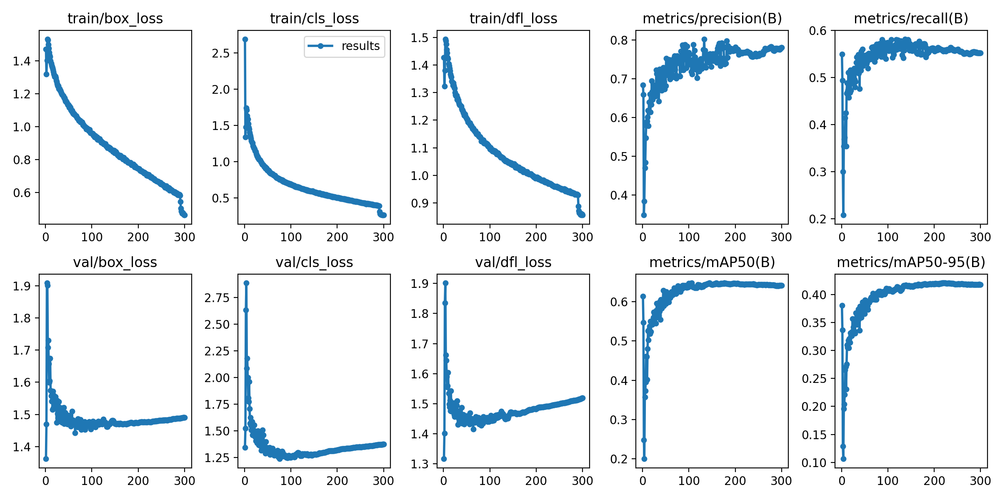
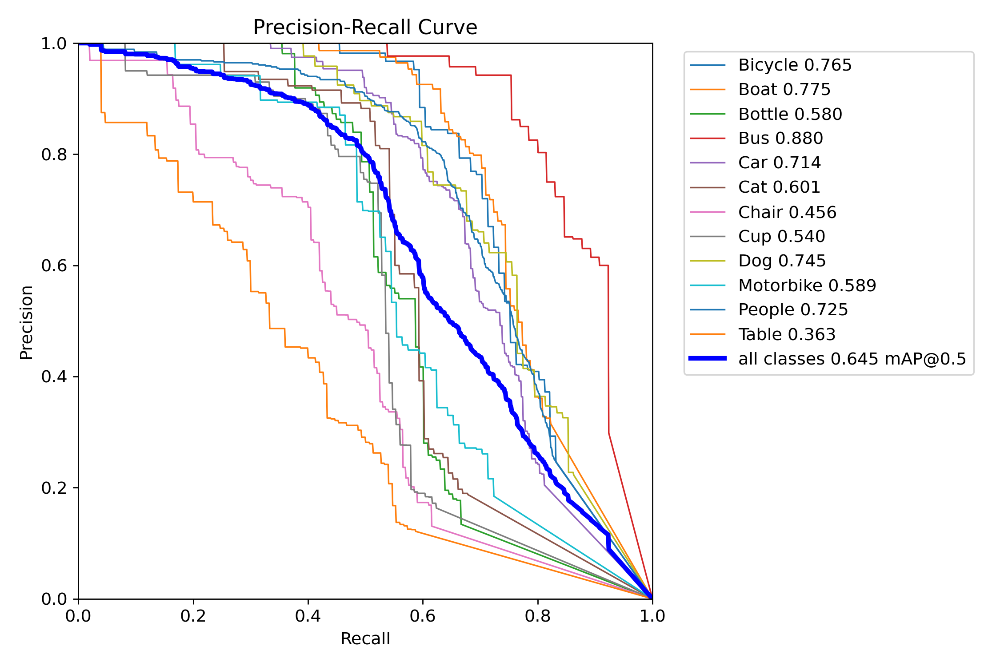
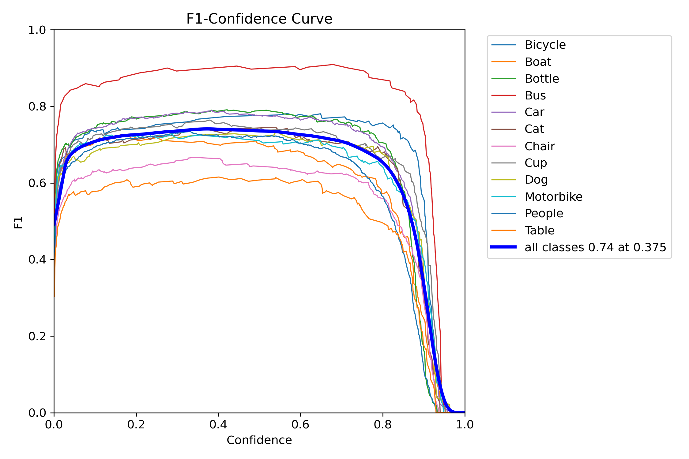
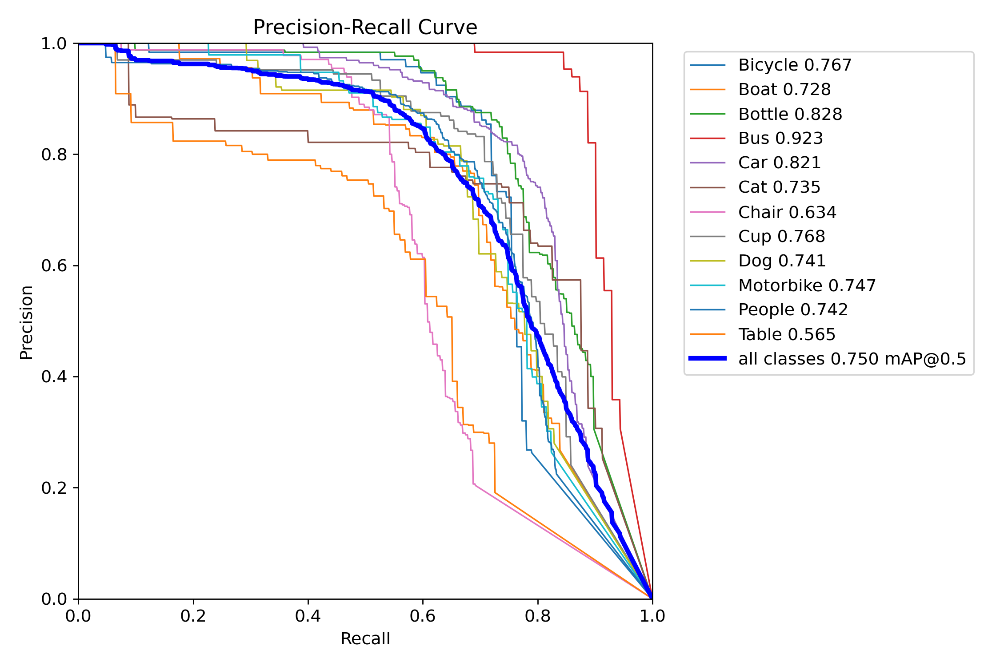
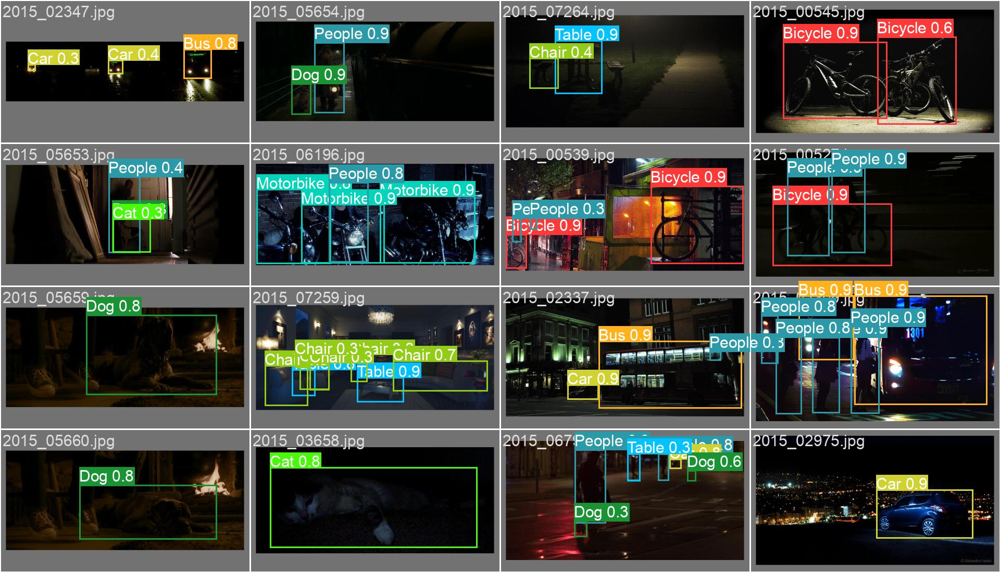
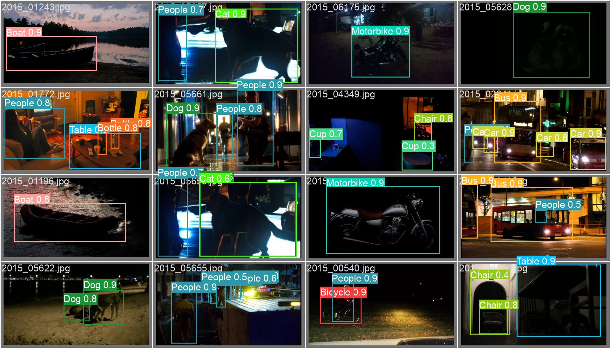
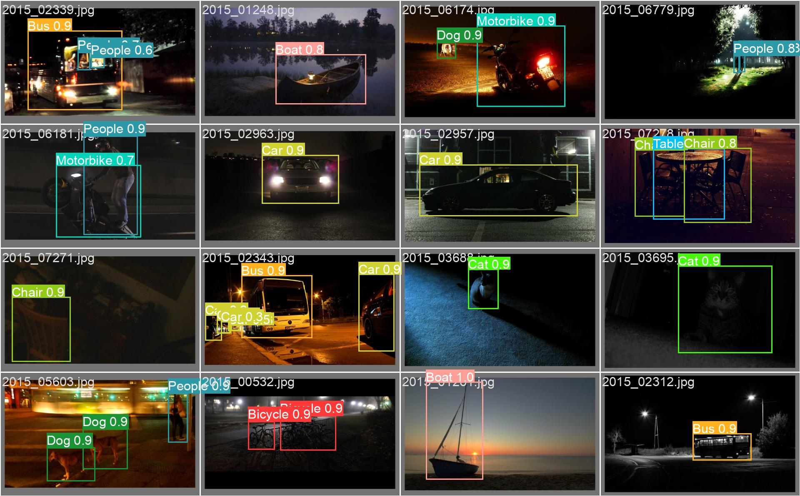

此项目是YOLOv8目标检测实战，训练的数据集是ExDark，但并没有YOLOv8的源码，
源码请跳转[ultralytics](https://github.com/ultralytics/ultralytics)。<br>
项目中的文件是一些环境的配置文件、作画工具、训练模型参数、验证及测试的相关结果等等。<br>
具体的环境配置、训练和测试过程，请跳转我的[CSDN文章](https://blog.csdn.net/SHY0978/article/details/138036693)
或者我的博客([方水云](https://blog.csdn.net/SHY0978))进行详细参考，谢谢！<br>

# 数据集介绍
ExDark数据集(找很久，就这个不是很大众，有标注，标注为(左上，右下坐标))。
ExDark数据集用于暗光下的目标检测，由马来西亚大学计算机科学与信息技术学院图像与信号处理中心发布。
ExDark数据集收集了一共7363张低光照的图片，从超级弱光环境到普通弱光环境（10种不同的光照条件），一共12个类别（类似于PASCACL VOC）。<br>
[ExDark数据集下载地址](https://aistudio.baidu.com/datasetdetail/129450)<br>
[ExDark数据集具体简介](https://zhuanlan.zhihu.com/p/472237704)<br>

## 数据集预处理
在原ExDark数据集当中，数据的格式和颜色空间不统一，格式：有jpg、png、jepg等，颜色空间不是统一的RGB。
所以直接使用该数据集进行YOLOv8的训练会一致引发libpng的反复警告，如下，很头疼。
```
slibpng warning: iCCP: known incorrect sRGB profile
libpng warning: iCCP: cHRM chunk does not match sRGB
```
recipy.py就是为了统一数据的格式和颜色空间，并且将原始标注(左上，右下坐标)转化成
YOLOv8的数据标注(中心，宽，高)，还将整个数据集按按8:1:1的比率划分成train:test:valid，
最后形成YOLOv8规定的datasets文件夹切分。
```
├─datasets
│  ├─ExDark
│     ├─test
│     │      images
│     │      labels
│     └─train
│            images
│     │      labels
│     └─valid
│            images
│     │      labels
```
# 结果展示
runs/detect文件下存放着训练、验证、测试和视频检测的相关结果。
## weights目录
该目录下保存了两个训练时的权重:<br>
1.last.pt：<br>
“last.pt” 一般指代模型训练过程中最后一个保存的权重文件。在训练过程中，模型的权重可能会定期保存，而 “last.pt” 就是最新的一次保存的模型权重文件。这样的文件通常用于从上一次训练的断点继续训练，或者用于模型的推理和评估。
<br>
2.best.pt：<br>
“best.pt” 则通常指代在验证集或测试集上表现最好的模型权重文件。在训练过程中，会通过监视模型在验证集上的性能，并在性能提升时保存模型的权重文件。“best.pt” 可以被用于得到在验证集上表现最好的模型，以避免模型在训练集上过拟合的问题。

## 训练部分指标展示
以下是一些与目标检测相关的损失函数和性能评价指标的解释：<br>
1.定位损失（box_loss）：<br>
定义： 衡量预测框与标注框之间的误差，通常使用 GIoU（Generalized Intersection over Union）来度量，其值越小表示定位越准确。<br>
目的： 通过最小化定位损失，使模型能够准确地定位目标。<br>
2.置信度损失（obj_loss）：<br>
定义： 计算网络对目标的置信度，通常使用二元交叉熵损失函数，其值越小表示模型判断目标的能力越准确。<br>
目的： 通过最小化置信度损失，使模型能够准确判断目标是否存在。<br>
3.分类损失（cls_loss）：<br>
定义： 计算锚框对应的分类是否正确，通常使用交叉熵损失函数，其值越小表示分类越准确。<br>
目的： 通过最小化分类损失，使模型能够准确分类目标。<br>
4.Precision（精度）：<br>
定义： 正确预测为正类别的样本数量占所有预测为正类别的样本数量的比例。<br>
目的： 衡量模型在所有预测为正例的样本中有多少是正确的。<br>
5.Recall（召回率）：<br>
定义： 正确预测为正类别的样本数量占所有真实正类别的样本数量的比例。<br>
目的： 衡量模型能够找出真实正例的能力。<br>
6.mAP（平均精度）：<br>
定义： 使用 Precision-Recall 曲线计算的面积，mAP@[.5:.95] 表示在不同 IoU 阈值下的平均 mAP。<br>
目的： 综合考虑了模型在不同精度和召回率条件下的性能，是目标检测任务中常用的评价指标。<br>


PR_curve:是精确率（Precision）和召回率（Recall）之间的关系。精确率表示预测为正例
的样本中真正为正例的比例，而召回率表示真正为正例的样本中被正确预测为正例的比例。
在PR Curve中，横坐标表示召回率，纵坐标表示精确率。通常情况下，当召回率升高时，
精确率会降低，反之亦然。PR Curve反映了这种取舍关系。曲线越靠近右上角，表示模型
在预测时能够同时保证高的精确率和高的召回率，即预测结果较为准确。相反，曲线越靠
近左下角，表示模型在预测时难以同时保证高的精确率和高的召回率，即预测结果较为不
准确。<br>


## 测试部分指标展示
F1曲线是一种多分类问题中常用的性能评估工具，尤其在竞赛中得到广泛应用。
它基于F1分数，这是精确率和召回率的调和平均数，取值范围介于0和1之间。
1代表最佳性能，而0代表最差性能。
<br>
<br>
<br>
<br>
<br>

## 视频实时检测展示
城市夜景<br>
<br>
秦淮河夜景<br>
